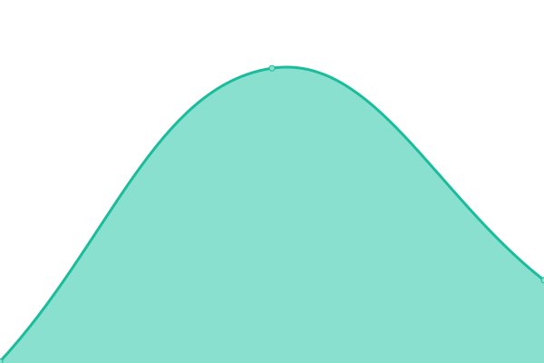

# [📈 Live Status](https://boriskhodok.github.io/wowsuptime): <!--live status--> **🟩 All systems operational**

This repository contains the open-source uptime monitor and status page for [boriskhodok](https://boriskhodok.github.io/wowsuptime), powered by [Upptime](https://github.com/upptime/upptime).

With [Upptime](https://upptime.js.org), you can get your own unlimited and free uptime monitor and status page, powered entirely by a GitHub repository. We use [Issues](https://github.com/boriskhodok/wowsuptime/issues) as incident reports, [Actions](https://github.com/boriskhodok/wowsuptime/actions) as uptime monitors, and [Pages](https://boriskhodok.github.io/wowsuptime) for the status page.

<!--start: status pages-->
<!-- This summary is generated by Upptime (https://github.com/upptime/upptime) -->
<!-- Do not edit this manually, your changes will be overwritten -->
<!-- prettier-ignore -->
| URL | Status | History | Response Time | Uptime |
| --- | ------ | ------- | ------------- | ------ |
|  [WoWS EU](https://worldofwarships.eu/) | 🟩 Up | [wo-ws-eu.yml](https://github.com/boriskhodok/wowsuptime/commits/HEAD/history/wo-ws-eu.yml) | 

 663ms
     
 | 

<a href="https://boriskhodok.github.io/wowsuptime/history/wo-ws-eu">100.00%</a>
    

|  [WoWS NA](https://worldofwarships.com/) | 🟩 Up | [wo-ws-na.yml](https://github.com/boriskhodok/wowsuptime/commits/HEAD/history/wo-ws-na.yml) | 

 130ms
     
 | 

<a href="https://boriskhodok.github.io/wowsuptime/history/wo-ws-na">100.00%</a>
    

|  [WoWS ASIA](https://worldofwarships.asia/) | 🟩 Up | [wo-ws-asia.yml](https://github.com/boriskhodok/wowsuptime/commits/HEAD/history/wo-ws-asia.yml) | 

 1524ms
     
 | 

<a href="https://boriskhodok.github.io/wowsuptime/history/wo-ws-asia">100.00%</a>
    

<!--end: status pages-->

[**Visit our status website →**](https://boriskhodok.github.io/wowsuptime)

## 📄 License

- Powered by: [Upptime](https://github.com/upptime/upptime)
- Code: [MIT](./LICENSE) © [boriskhodok](https://boriskhodok.github.io/wowsuptime)
- Data in the `./history` directory: [Open Database License](https://opendatacommons.org/licenses/odbl/1-0/)
