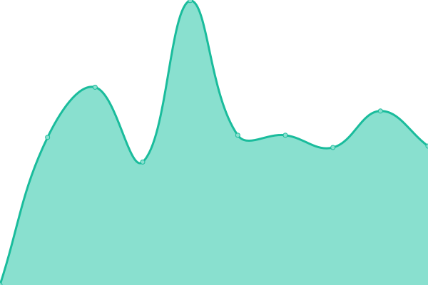

# [📈 Live Status](https://boriskhodok.github.io/wowsuptime): <!--live status--> **🟧 Partial outage**

This repository contains the open-source uptime monitor and status page for [boriskhodok](https://boriskhodok.github.io/wowsuptime), powered by [Upptime](https://github.com/upptime/upptime).

With [Upptime](https://upptime.js.org), you can get your own unlimited and free uptime monitor and status page, powered entirely by a GitHub repository. We use [Issues](https://github.com/boriskhodok/wowsuptime/issues) as incident reports, [Actions](https://github.com/boriskhodok/wowsuptime/actions) as uptime monitors, and [Pages](https://boriskhodok.github.io/wowsuptime) for the status page.

<!--start: status pages-->
<!-- This summary is generated by Upptime (https://github.com/upptime/upptime) -->
<!-- Do not edit this manually, your changes will be overwritten -->
<!-- prettier-ignore -->
| URL | Status | History | Response Time | Uptime |
| --- | ------ | ------- | ------------- | ------ |
|  [worldofwarships.eu](https://worldofwarships.eu) | 🟩 Up | [worldofwarships-eu.yml](https://github.com/boriskhodok/wowsuptime/commits/HEAD/history/worldofwarships-eu.yml) | 

 527ms
     
 | 

<a href="https://boriskhodok.github.io/wowsuptime/history/worldofwarships-eu">100.00%</a>
    

|  [clans.worldofwarships.eu](https://clans.worldofwarships.eu) | 🟩 Up | [clans-worldofwarships-eu.yml](https://github.com/boriskhodok/wowsuptime/commits/HEAD/history/clans-worldofwarships-eu.yml) | 

 1621ms
     
 | 

<a href="https://boriskhodok.github.io/wowsuptime/history/clans-worldofwarships-eu">100.00%</a>
    

|  [armory.worldofwarships.eu](https://armory.worldofwarships.eu) | 🟩 Up | [armory-worldofwarships-eu.yml](https://github.com/boriskhodok/wowsuptime/commits/HEAD/history/armory-worldofwarships-eu.yml) | 

 1741ms
     
 | 

<a href="https://boriskhodok.github.io/wowsuptime/history/armory-worldofwarships-eu">98.96%</a>
    

|  [dockyard.worldofwarships.eu](https://dockyard.worldofwarships.eu) | 🟩 Up | [dockyard-worldofwarships-eu.yml](https://github.com/boriskhodok/wowsuptime/commits/HEAD/history/dockyard-worldofwarships-eu.yml) | 

 596ms
     
 | 

<a href="https://boriskhodok.github.io/wowsuptime/history/dockyard-worldofwarships-eu">100.00%</a>
    

|  [logbook.worldofwarships.eu](https://logbook.worldofwarships.eu) | 🟩 Up | [logbook-worldofwarships-eu.yml](https://github.com/boriskhodok/wowsuptime/commits/HEAD/history/logbook-worldofwarships-eu.yml) | 

 569ms
     
 | 

<a href="https://boriskhodok.github.io/wowsuptime/history/logbook-worldofwarships-eu">100.00%</a>
    

|  [friends.worldofwarships.eu](https://friends.worldofwarships.eu/en/about) | 🟩 Up | [friends-worldofwarships-eu.yml](https://github.com/boriskhodok/wowsuptime/commits/HEAD/history/friends-worldofwarships-eu.yml) | 

 651ms
     
 | 

<a href="https://boriskhodok.github.io/wowsuptime/history/friends-worldofwarships-eu">100.00%</a>
    

|  [warehouse.worldofwarships.eu](https://warehouse.worldofwarships.eu) | 🟥 Down | [warehouse-worldofwarships-eu.yml](https://github.com/boriskhodok/wowsuptime/commits/HEAD/history/warehouse-worldofwarships-eu.yml) | 

 465ms
     
 | 

<a href="https://boriskhodok.github.io/wowsuptime/history/warehouse-worldofwarships-eu">0.00%</a>
    

|  [shop.worldofwarships.eu](https://shop.worldofwarships.eu/) | 🟩 Up | [shop-worldofwarships-eu.yml](https://github.com/boriskhodok/wowsuptime/commits/HEAD/history/shop-worldofwarships-eu.yml) | 

 626ms
     
 | 

<a href="https://boriskhodok.github.io/wowsuptime/history/shop-worldofwarships-eu">100.00%</a>
    

|  [worldofwarships.com](https://worldofwarships.com) | 🟩 Up | [worldofwarships-com.yml](https://github.com/boriskhodok/wowsuptime/commits/HEAD/history/worldofwarships-com.yml) | 

 149ms
     
 | 

<a href="https://boriskhodok.github.io/wowsuptime/history/worldofwarships-com">100.00%</a>
    

|  [clans.worldofwarships.com](https://clans.worldofwarships.com) | 🟩 Up | [clans-worldofwarships-com.yml](https://github.com/boriskhodok/wowsuptime/commits/HEAD/history/clans-worldofwarships-com.yml) | 

 670ms
     
 | 

<a href="https://boriskhodok.github.io/wowsuptime/history/clans-worldofwarships-com">100.00%</a>
    

|  [armory.worldofwarships.com](https://armory.worldofwarships.com) | 🟩 Up | [armory-worldofwarships-com.yml](https://github.com/boriskhodok/wowsuptime/commits/HEAD/history/armory-worldofwarships-com.yml) | 

 841ms
     
 | 

<a href="https://boriskhodok.github.io/wowsuptime/history/armory-worldofwarships-com">98.53%</a>
    

|  [blog.worldofwarships.com](https://blog.worldofwarships.com) | 🟩 Up | [blog-worldofwarships-com.yml](https://github.com/boriskhodok/wowsuptime/commits/HEAD/history/blog-worldofwarships-com.yml) | 

 634ms
     
 | 

<a href="https://boriskhodok.github.io/wowsuptime/history/blog-worldofwarships-com">100.00%</a>
    

|  [dockyard.worldofwarships.com](https://dockyard.worldofwarships.com) | 🟩 Up | [dockyard-worldofwarships-com.yml](https://github.com/boriskhodok/wowsuptime/commits/HEAD/history/dockyard-worldofwarships-com.yml) | 

 224ms
     
 | 

<a href="https://boriskhodok.github.io/wowsuptime/history/dockyard-worldofwarships-com">100.00%</a>
    

|  [logbook.worldofwarships.com](https://logbook.worldofwarships.com) | 🟩 Up | [logbook-worldofwarships-com.yml](https://github.com/boriskhodok/wowsuptime/commits/HEAD/history/logbook-worldofwarships-com.yml) | 

 237ms
     
 | 

<a href="https://boriskhodok.github.io/wowsuptime/history/logbook-worldofwarships-com">100.00%</a>
    

|  [friends.worldofwarships.com](https://friends.worldofwarships.com/en/about) | 🟩 Up | [friends-worldofwarships-com.yml](https://github.com/boriskhodok/wowsuptime/commits/HEAD/history/friends-worldofwarships-com.yml) | 

 247ms
     
 | 

<a href="https://boriskhodok.github.io/wowsuptime/history/friends-worldofwarships-com">100.00%</a>
    

|  [warehouse.worldofwarships.com](https://warehouse.worldofwarships.com) | 🟥 Down | [warehouse-worldofwarships-com.yml](https://github.com/boriskhodok/wowsuptime/commits/HEAD/history/warehouse-worldofwarships-com.yml) | 

 185ms
     
 | 

<a href="https://boriskhodok.github.io/wowsuptime/history/warehouse-worldofwarships-com">0.00%</a>
    

|  [shop.worldofwarships.com](https://shop.worldofwarships.com/) | 🟩 Up | [shop-worldofwarships-com.yml](https://github.com/boriskhodok/wowsuptime/commits/HEAD/history/shop-worldofwarships-com.yml) | 

 190ms
     
 | 

<a href="https://boriskhodok.github.io/wowsuptime/history/shop-worldofwarships-com">100.00%</a>
    

|  [worldofwarships.asia](https://worldofwarships.asia) | 🟩 Up | [worldofwarships-asia.yml](https://github.com/boriskhodok/wowsuptime/commits/HEAD/history/worldofwarships-asia.yml) | 

 1038ms
     
 | 

<a href="https://boriskhodok.github.io/wowsuptime/history/worldofwarships-asia">100.00%</a>
    

|  [clans.worldofwarships.asia](https://clans.worldofwarships.asia) | 🟩 Up | [clans-worldofwarships-asia.yml](https://github.com/boriskhodok/wowsuptime/commits/HEAD/history/clans-worldofwarships-asia.yml) | 

 2638ms
     
 | 

<a href="https://boriskhodok.github.io/wowsuptime/history/clans-worldofwarships-asia">100.00%</a>
    

|  [armory.worldofwarships.asia](https://armory.worldofwarships.asia) | 🟩 Up | [armory-worldofwarships-asia.yml](https://github.com/boriskhodok/wowsuptime/commits/HEAD/history/armory-worldofwarships-asia.yml) | 

 2756ms
     
 | 

<a href="https://boriskhodok.github.io/wowsuptime/history/armory-worldofwarships-asia">98.95%</a>
    

|  [dockyard.worldofwarships.asia](https://dockyard.worldofwarships.asia) | 🟩 Up | [dockyard-worldofwarships-asia.yml](https://github.com/boriskhodok/wowsuptime/commits/HEAD/history/dockyard-worldofwarships-asia.yml) | 

 942ms
     
 | 

<a href="https://boriskhodok.github.io/wowsuptime/history/dockyard-worldofwarships-asia">100.00%</a>
    

|  [logbook.worldofwarships.asia](https://logbook.worldofwarships.asia) | 🟩 Up | [logbook-worldofwarships-asia.yml](https://github.com/boriskhodok/wowsuptime/commits/HEAD/history/logbook-worldofwarships-asia.yml) | 

 806ms
     
 | 

<a href="https://boriskhodok.github.io/wowsuptime/history/logbook-worldofwarships-asia">100.00%</a>
    

|  [friends.worldofwarships.asia](https://friends.worldofwarships.asia/en/about) | 🟩 Up | [friends-worldofwarships-asia.yml](https://github.com/boriskhodok/wowsuptime/commits/HEAD/history/friends-worldofwarships-asia.yml) | 

 1211ms
     
 | 

<a href="https://boriskhodok.github.io/wowsuptime/history/friends-worldofwarships-asia">100.00%</a>
    

|  [warehouse.worldofwarships.asia](https://warehouse.worldofwarships.asia) | 🟥 Down | [warehouse-worldofwarships-asia.yml](https://github.com/boriskhodok/wowsuptime/commits/HEAD/history/warehouse-worldofwarships-asia.yml) | 

 850ms
     
 | 

<a href="https://boriskhodok.github.io/wowsuptime/history/warehouse-worldofwarships-asia">0.00%</a>
    

|  [shop.worldofwarships.asia](https://shop.worldofwarships.asia/) | 🟩 Up | [shop-worldofwarships-asia.yml](https://github.com/boriskhodok/wowsuptime/commits/HEAD/history/shop-worldofwarships-asia.yml) | 

 1052ms
     
 | 

<a href="https://boriskhodok.github.io/wowsuptime/history/shop-worldofwarships-asia">100.00%</a>
    

|  [wowsgame.cn](https://wowsgame.cn) | 🟩 Up | [wowsgame-cn.yml](https://github.com/boriskhodok/wowsuptime/commits/HEAD/history/wowsgame-cn.yml) | 

 1378ms
     
 | 

<a href="https://boriskhodok.github.io/wowsuptime/history/wowsgame-cn">100.00%</a>
    

|  [clans.wowsgame.cn](https://clans.wowsgame.cn) | 🟩 Up | [clans-wowsgame-cn.yml](https://github.com/boriskhodok/wowsuptime/commits/HEAD/history/clans-wowsgame-cn.yml) | 

 2726ms
     
 | 

<a href="https://boriskhodok.github.io/wowsuptime/history/clans-wowsgame-cn">99.76%</a>
    

|  [armory.wowsgame.cn](https://armory.wowsgame.cn) | 🟩 Up | [armory-wowsgame-cn.yml](https://github.com/boriskhodok/wowsuptime/commits/HEAD/history/armory-wowsgame-cn.yml) | 

 3167ms
     
 | 

<a href="https://boriskhodok.github.io/wowsuptime/history/armory-wowsgame-cn">100.00%</a>
    

|  [dockyard.wowsgame.cn](https://dockyard.wowsgame.cn) | 🟩 Up | [dockyard-wowsgame-cn.yml](https://github.com/boriskhodok/wowsuptime/commits/HEAD/history/dockyard-wowsgame-cn.yml) | 

 1125ms
     
 | 

<a href="https://boriskhodok.github.io/wowsuptime/history/dockyard-wowsgame-cn">100.00%</a>
    

|  [logbook.wowsgame.cn](https://logbook.wowsgame.cn) | 🟩 Up | [logbook-wowsgame-cn.yml](https://github.com/boriskhodok/wowsuptime/commits/HEAD/history/logbook-wowsgame-cn.yml) | 

 1119ms
     
 | 

<a href="https://boriskhodok.github.io/wowsuptime/history/logbook-wowsgame-cn">100.00%</a>
    

|  [friends.wowsgame.cn](https://friends.wowsgame.cn/en/about) | 🟩 Up | [friends-wowsgame-cn.yml](https://github.com/boriskhodok/wowsuptime/commits/HEAD/history/friends-wowsgame-cn.yml) | 

 1263ms
     
 | 

<a href="https://boriskhodok.github.io/wowsuptime/history/friends-wowsgame-cn">100.00%</a>
    

|  [warehouse.wowsgame.cn](https://warehouse.wowsgame.cn) | 🟥 Down | [warehouse-wowsgame-cn.yml](https://github.com/boriskhodok/wowsuptime/commits/HEAD/history/warehouse-wowsgame-cn.yml) | 

 1619ms
     
 | 

<a href="https://boriskhodok.github.io/wowsuptime/history/warehouse-wowsgame-cn">0.00%</a>
    

|  [shop.wows.360.cn](https://shop.wows.360.cn) | 🟩 Up | [shop-wows-360-cn.yml](https://github.com/boriskhodok/wowsuptime/commits/HEAD/history/shop-wows-360-cn.yml) | 

 2048ms
     
 | 

<a href="https://boriskhodok.github.io/wowsuptime/history/shop-wows-360-cn">100.00%</a>
    

<!--end: status pages-->

[**Visit our status website →**](https://boriskhodok.github.io/wowsuptime)

## 📄 License

- Powered by: [Upptime](https://github.com/upptime/upptime)
- Code: [MIT](./LICENSE) © [boriskhodok](https://boriskhodok.github.io/wowsuptime)
- Data in the `./history` directory: [Open Database License](https://opendatacommons.org/licenses/odbl/1-0/)
